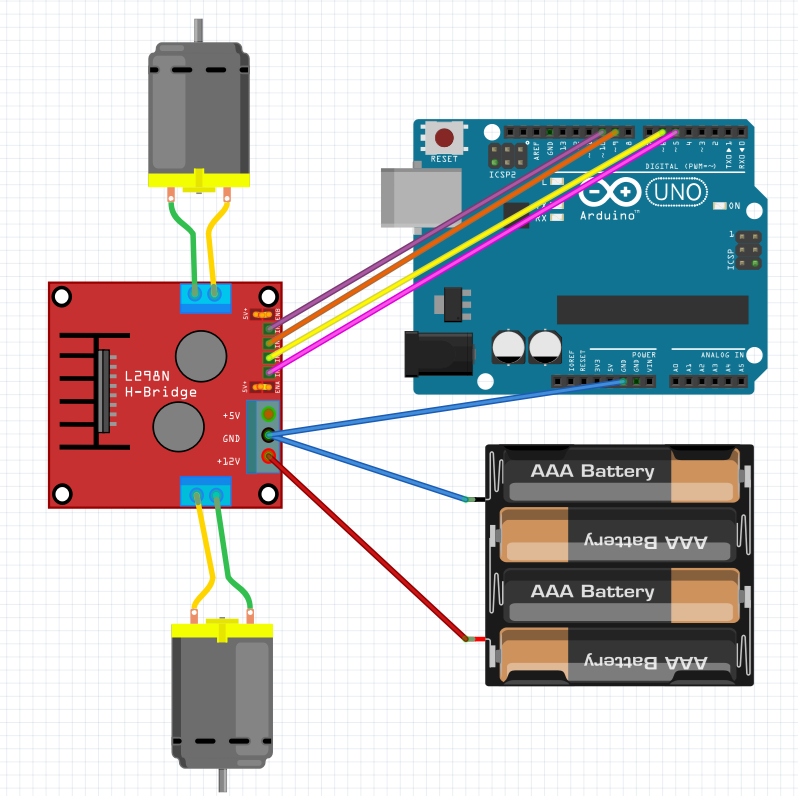

# Arduino Motor Engine - Car Motor Controller

## Description

This project is an Arduino test program to control the motors of a robotic car. It allows testing basic movements (forward, backward, turn right and left) before integration into a more complex robotics project.

## Features

- **Directional control**: Forward, backward, turn right and left
- **Speed management**: PWM control of motor power (0-100%)
- **Differential steering**: Turns are performed by rotating the two drive wheels in opposite directions
- **Safety**: Use of an L298N component to isolate the Arduino from motor power

## Required Hardware

- Arduino (Uno, Nano, etc.)
- L298N module (motor driver)
- 2 DC motors
- External power supply for motors (do not power motors from Arduino)
- Connection cables

## Wiring Diagram



### Arduino to L298N Connections

| Arduino Pin | L298N Pin | Description |
|-------------|-----------|-------------|
| 10 | IN1 | Motor 1 - Control 1 |
| 9  | IN2 | Motor 1 - Control 2 |
| 5  | IN3 | Motor 2 - Control 1 |
| 6  | IN4 | Motor 2 - Control 2 |

**⚠️ Important:** 
- Power the L298N with an external source (not the Arduino)
- Connect the grounds (GND) together
- The L298N protects the Arduino from motor current spikes

## Operation

### Available Movements

1. **Forward**: Both motors rotate forward
2. **Backward**: Both motors rotate backward  
3. **Turn left**: Motor 1 forward, Motor 2 backward
4. **Turn right**: Motor 1 backward, Motor 2 forward
5. **Stop**: Both motors stop

### Test Sequence

The program automatically executes this sequence in a loop:

1. Forward at 100% power (2 seconds)
2. Stop (0.5 second)
3. Backward at 100% power (2 seconds)
4. Stop (0.5 second)
5. Turn left at 40% power (2 seconds)
6. Stop (2 seconds)
7. Turn right at 40% power (2 seconds)
8. Stop (2 seconds)

## Code Structure

### Main Constants

```cpp
const int back = -1;          // Backward direction
const int forward = 1;        // Forward direction
const int stopEngine = 0;     // Motor stop
const int motor1 = 0;         // Motor 1 identifier
const int motor2 = 1;         // Motor 2 identifier
```

### Main Functions

- `SetEngine(motorId, power, action)`: Control an individual motor
- `MoveForward(power)`: Move forward with given power
- `MoveBack(power)`: Move backward with given power
- `Left()`: Turn left
- `Right()`: Turn right
- `Stop()`: Stop all motors

## Installation and Usage

1. **Wiring**: Connect components according to the diagram above
2. **Code**: Upload the `src/voiture.ino` file to the Arduino
3. **Test**: The test sequence starts automatically

## Customization

### Modify Rotation Speed

Change values in the `Left()` and `Right()` functions:

```cpp
void Left()
  SetEngine(motor1, 60, forward);  // Change 40 to 60 for more speed

  SetEngine(motor2, 60, back);
}
```

### Modify Test Sequence

Adapt the `loop()` function to change movements and durations.

### Adjust Pins

Modify the `motors` array to use other pins:

```cpp
const byte motors[2][2] = {
  { 10,  9 }, // motor 1 - pins IN1, IN2
  { 5, 6  }   // motor 2 - pins IN3, IN4
};
```

## Safety

- **Never power motors directly from Arduino**
- Use appropriate external power supply for motors
- The L298N provides necessary isolation and protection
- Check connections before powering on

## Possible Enhancements

This test code can be extended for:
- Remote control (IR, Bluetooth, WiFi)
- Distance sensors for obstacle avoidance
- Variable speed control via potentiometer
- Serial interface for manual commands
- Integration into a more complex robotics project

## License

Free project for learning and prototyping purposes.