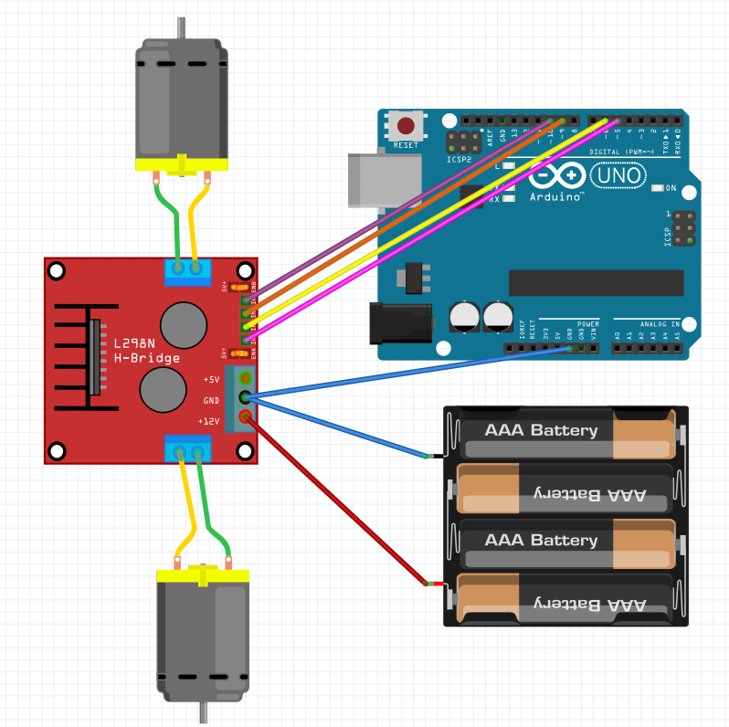

# Arduino Motor Engine - Contrôleur de Moteurs pour Voiture

## Description

Ce projet est un programme de test Arduino pour contrôler les moteurs d'une voiture robotique. Il permet de tester les mouvements de base (avancer, reculer, tourner à droite et à gauche) avant intégration dans un projet robotique plus complexe.

## Caractéristiques

- **Contrôle directionnel** : Avancer, reculer, tourner à droite et à gauche
- **Gestion de la vitesse** : Contrôle PWM de la puissance des moteurs (0-100%)
- **Direction différentielle** : Les virages sont effectués en faisant tourner les deux roues motrices dans des sens opposées
- **Sécurité** : Utilisation d'un composant L298N pour isoler l'Arduino de la puissance des moteurs

## Matériel requis

- Arduino (Uno, Nano, etc.)
- Module L298N (driver moteur)
- 2 moteurs DC
- Alimentation externe pour les moteurs (ne pas alimenter les moteurs depuis l'Arduino)
- Câbles de connexion

## Schéma de câblage



### Connexions Arduino vers L298N

| Arduino Pin | L298N Pin | Description |
|-------------|-----------|-------------|
| 10 | IN1 | Moteur 1 - Commande 1 |
| 9  | IN2 | Moteur 1 - Commande 2 |
| 5  | IN3 | Moteur 2 - Commande 1 |
| 6  | IN4 | Moteur 2 - Commande 2 |

**⚠️ Important :** 
- Alimenter le L298N avec une source externe (pas l'Arduino)
- Connecter les masses (GND) ensemble
- Le L298N protège l'Arduino des pics de courant des moteurs

## Fonctionnement

### Mouvements disponibles

1. **Avancer** : Les deux moteurs tournent vers l'avant
2. **Reculer** : Les deux moteurs tournent vers l'arrière  
3. **Tourner à gauche** : Moteur 1 vers l'avant, Moteur 2 vers l'arrière
4. **Tourner à droite** : Moteur 1 vers l'arrière, Moteur 2 vers l'avant
5. **Arrêt** : Les deux moteurs s'arrêtent

### Séquence de test

Le programme exécute automatiquement cette séquence en boucle :

1. Avancer à 100% de puissance (2 secondes)
2. Arrêt (0.5 seconde)
3. Reculer à 100% de puissance (2 secondes)
4. Arrêt (0.5 seconde)
5. Tourner à gauche à 40% de puissance (2 secondes)
6. Arrêt (2 secondes)
7. Tourner à droite à 40% de puissance (2 secondes)
8. Arrêt (2 secondes)

## Structure du code

### Constantes principales

```cpp
const int back = -1;          // Direction arrière
const int forward = 1;        // Direction avant
const int stopEngine = 0;     // Arrêt moteur
const int motor1 = 0;         // Identifiant moteur 1
const int motor2 = 1;         // Identifiant moteur 2
```

### Fonctions principales

- `SetEngine(motorId, power, action)` : Contrôle un moteur individuel
- `MoveForward(power)` : Avancer avec une puissance donnée
- `MoveBack(power)` : Reculer avec une puissance donnée
- `Left()` : Tourner à gauche
- `Right()` : Tourner à droite
- `Stop()` : Arrêter tous les moteurs

## Installation et utilisation

1. **Câblage** : Connecter les composants selon le schéma ci-dessus
2. **Code** : Téléverser le fichier `src/voiture.ino` sur l'Arduino
3. **Test** : La séquence de test démarre automatiquement

## Personnalisation

### Modifier la vitesse de rotation

Changer les valeurs dans les fonctions `Left()` et `Right()` :

```cpp
void Left()
  SetEngine(motor1, 60, forward);  // Changer 40 en 60 pour plus de vitesse

  SetEngine(motor2, 60, back);
}
```

### Modifier la séquence de test

Adapter la fonction `loop()` pour changer les mouvements et les durées.

### Ajuster les pins

Modifier le tableau `motors` pour utiliser d'autres pins :

```cpp
const byte motors[2][2] = {
  { 10,  9 }, // motor 1 - pins IN1, IN2
  { 5, 6  }   // motor 2 - pins IN3, IN4
};
```

## Sécurité

- **Ne jamais alimenter les moteurs directement depuis l'Arduino**
- Utiliser une alimentation externe appropriée pour les moteurs
- Le L298N assure l'isolation et la protection nécessaire
- Vérifier les connexions avant la mise sous tension

## Évolutions possibles

Ce code de test peut être étendu pour :
- Contrôle par télécommande (IR, Bluetooth, WiFi)
- Capteurs de distance pour évitement d'obstacles
- Contrôle de vitesse variable via potentiomètre
- Interface série pour commandes manuelles
- Intégration dans un projet robotique plus complexe

## Licence

Projet libre d'utilisation pour l'apprentissage et le prototypage.